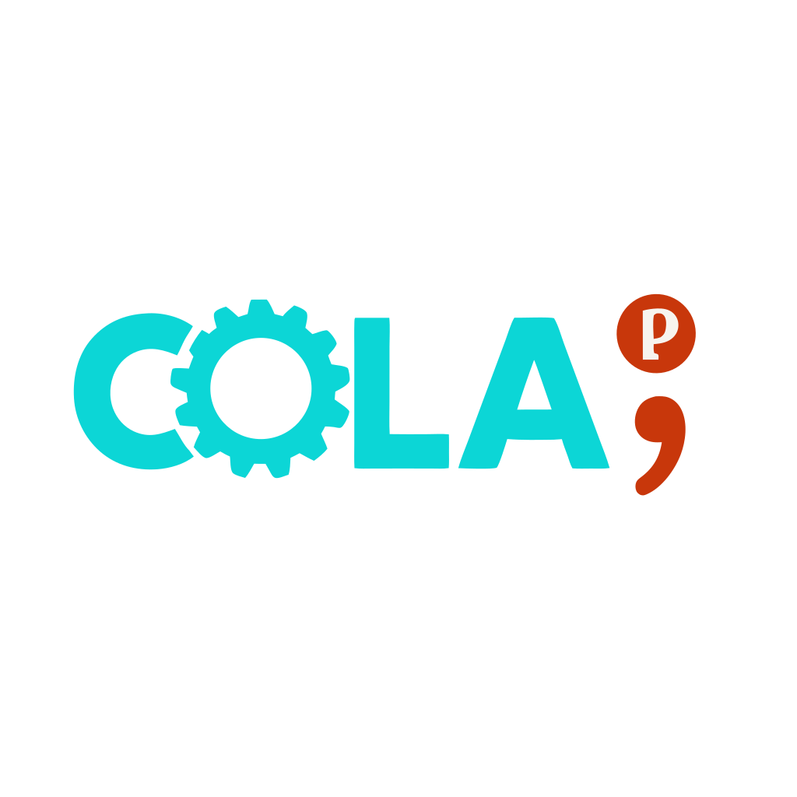

<p align="center">
  
</p>

# 🥤 colap – A Refreshingly Simple Configuration Language Parser & Code Generator

---

Tired of fighting with your config files? So were we.

**cola** is a lightweight, human-friendly configuration language designed to avoid YAML’s whitespace traps, JSON’s curly-brace fatigue, and TOML’s dotted-key spaghetti. It’s backed by [`colap`](https://crates.io/crates/colap), a Rust parser and code generator that makes working with configurations effortless.

Cola is:

✅ **Readable** – Clean nesting with minimal punctuation.\
✅ **Writable** – No indentation anxiety. No trailing comma drama.\
✅ **Composable** – Works standalone or embedded in Markdown as fenced `cola ... ` blocks.

---

## 🚀 Why cola?

### YAML: Tabs vs Spaces

Miss one indent, and your app silently loads nonsense.

### JSON: Curly Braces Forever

Nested configs turn into a forest of `{}` and `[]`.

### TOML: Dotted-Key Spaghetti

Deep nesting forces verbose dotted keys or confusing table headers.

### cola: Refreshingly Simple

- 🆓 **Not whitespace sensitive** – Tabs? Spaces? Mix them. Cola doesn’t care.
- ✅ **Minimal punctuation** – Just `:` for nesting and `;` to end blocks.
- 🏷️ **Infix plural syntax** – Explicitly name singular and plural forms for code generators.
- 📄 **Markdown-native** – Embed configs directly in documentation.

---

## 📖 Example Configuration

Here's a real-world configuration defining multiple LLM providers:

```cola
llm plural llms:
    openai:
        api:
            type: "REST",
            key: "some_api_key",
            base_url: "some_base_url"
        ;

        model plural models:
            gpt-4.1:
                name: "gpt-4.1",
                max_input_tokens: 1048576,
                output_price: 8.0,
                supports_vision: true
            ;
            gpt-4o:
                name: "gpt-4o",
                max_input_tokens: 1048576,
                output_price: 8.0,
                supports_vision: true
            ;
        ;
    ;
;
```

---

## 🆚 cola vs YAML / JSON / TOML

| Feature                      | YAML          | JSON         | TOML         | **cola**      |
|------------------------------|---------------|--------------|--------------|---------------|
| Whitespace sensitivity       | 😬 Yes         | 👍 No         | 👍 No         | ✅ No          |
| Curly brace clutter          | 👍 Minimal     | 😩 Lots       | 👍 Minimal    | ✅ Minimal     |
| Trailing commas allowed      | ❌ No          | ❌ No         | ✅ Yes        | ✅ Yes         |
| Multi-line strings           | 🤔 Hard        | 😕 Escapes    | ✅ Easy       | ✅ Easy        |
| Collections (arrays/maps)    | 😕 Indents     | 😩 `[]`, `{}` | 😕 Mixed      | ✅ Infix `plural` |
| Markdown embedding           | ❌ Awkward     | ❌ Awkward    | ❌ Awkward    | ✅ First-class |

---

## 🎯 Design Philosophy

### 🔹 Why Semicolons?

Cola uses `;` as a block terminator:

- Prevents ambiguity at the end of nested blocks.
- Avoids silent parsing errors from missing indentation (YAML) or commas (JSON).
- Familiar and clear for both humans and parsers.

---

### 🔹 Why Infix `plural`?

```cola
model plural models:
    gpt-4:
        name: "gpt-4"
    ;
    gpt-4o:
        name: "gpt-4o"
    ;
;
```

- Makes singular and plural forms **explicit** in configuration.
- Eliminates brittle “add an `s`” heuristics in code generation.
- Supports irregular plurals (e.g. `person plural people`).
- Improves clarity: developers instantly know single vs multiple semantics.

---

## 🔧 Features

### Parser

- Parses standalone `.cola` files and Markdown files with embedded cola blocks
- Produces structured configuration models

### Code Generator

- Generates idiomatic Rust structs and collections (`HashMap`) from cola models
- Handles plural entities clearly
- Renames Rust keywords (e.g., `type` to `type_`)
- Provides constructors and accessor methods for easy integration

---

## 📦 Installation

Add `colap` to your Rust project:

```toml
[dependencies]
colap = "0.1"
```

---

## 🚩 Usage

### Command Line Interface

```bash
USAGE:
    colap [OPTIONS] <input>

ARGS:
    <input>    Input .cola file or markdown containing Cola code blocks

OPTIONS:
    -h, --help                     Print help information
    -m, --mode <MODE>              Generation mode: 'crate' or 'module' (default: crate)
    -n, --crate-name <NAME>        Name of the generated library crate (default: input-file-stem-config)
    -o, --output <DIR>             Base output directory (default: generated)
    -V, --version                  Print version information
```

### Examples

#### Basic Crate Generation (Default)

Generate a complete Rust crate from a cola file:

```sh
colap path/to/myconfig.cola
```

This will:

1. Parse `myconfig.cola`
2. Generate code in the directory `generated/myconfig-config/`
3. Create a complete library crate with:
   - `Cargo.toml` with dependencies
   - `src/lib.rs` with generated structs
   - `tests/integration.rs` with integration tests
   - `README.md` with usage documentation

#### Module Generation

Generate a single Rust module file for embedding in your project:

```bash
colap path/to/myconfig.cola --mode module -o src -n config_parser
```

This will:

1. Parse `myconfig.cola`
2. Generate a single file `src/config_parser.rs`
3. Include inline unit tests within the module
4. Ready to be imported with `mod config_parser;` in your project

#### Custom crate name and output directory

```bash
colap path/to/myconfig.cola --crate-name my-custom-config --output custom/output/dir
```

This will:

1. Parse `myconfig.cola`
2. Generate code in the directory `custom/output/dir/my-custom-config/`
3. Create a library crate with generated structs in `custom/output/dir/my-custom-config/lib.rs`

## Code Generation Details

The code generator produces:

1. Rust structs for each entity type in the configuration
2. Collection structs (using `HashMap`) for plural entities
3. Accessor methods to retrieve fields and collections
4. Constructors for each entity type
5. Integration tests for validating parsing functionality

### Generated Code Structure

For a configuration file with entities like `Root`, `Llm`, and `Model`, the generator produces:

```rust
// Root entity struct
pub struct Root {
    llm: Llm,
    // other fields...
}

// Singular entity
pub struct Llm {
    provider: String,
    models: Models,  // plural entity reference
    // other fields...
}

// Plural entity (collection)
pub struct Models {
    entries: HashMap<String, Model>,
}

// Entity in a collection
pub struct Model {
    name: String,
    context_window: i64,
    // other fields...
}
```

### Type Handling

The generator maps Cola types to Rust types as follows:

| Cola Type | Rust Type |
|-----------|----------|
| String | `String` |
| Integer | `i64` |
| Float | `f64` |
| Boolean | `bool` |
| Entity | Custom struct |
| Optional Entity | `Option<CustomStruct>` |

### Default Crate Name

If the `--crate-name` option is not provided, the crate name is derived from the input file:

1. Take the file stem (filename without extension)
2. Replace underscores with hyphens
3. Convert to lowercase
4. Append `-config` suffix

For example:

- `my_config.cola` → `my-config-config`
- `API_Model.md` → `api-model-config`

## Using the Generated Code

### Loading and Parsing a Configuration File

The generated code includes integration tests that demonstrate how to parse configuration files:

```rust
use colap::cola::ColaParser;
use colap::model_builder::ModelBuilder;
use my_config::Root;  // Generated crate name

// Load and parse a configuration file
fn parse_config_file(path: &str) -> Root {
    // Read the file content
    let content = std::fs::read_to_string(path).expect("Failed to read config file");
    
    // Create a parser and parse the content
    let parser = ColaParser::new();
    let result = parser.parse(&content).expect("Failed to parse configuration");
    
    // Build the configuration model
    let model = ModelBuilder::build_config_model(&result).expect("Failed to build config model");
    
    // Create the root entity from the model
    Root::from_model(&model)
}

// Usage example
let config = parse_config_file("path/to/config.md");
```

### Accessing Configuration Values

The generated code provides accessor methods for retrieving values:

```rust
// Get the LLM configuration
let llm = config.llm();

// Access a singular entity's properties
let provider = llm.provider();  // Returns a &String

// Access a collection (plural entity)
let models = llm.models();

// Get a specific model from the collection
if let Some(gpt4) = models.get("gpt-4.1") {
    let context_window = gpt4.context_window();  // Returns an i64
    println!("GPT-4.1 context window: {}", context_window);
}

// Iterate through all models
for (name, model) in models.iter() {
    println!("Model: {}, Context: {}", name, model.context_window());
}
```

### Optional Fields

Optional fields are represented as `Option<T>` types:

```rust
// Optional field access with safe pattern matching
if let Some(api) = llm.api() {
    if let Some(key) = api.key() {
        println!("API Key: {}", key);
    }
}

// Using map() for clean optional chaining
let api_type = llm.api().and_then(|api| api.type_()).unwrap_or("No API type specified");
```

### 📄 Embedded Markdown Support

Colap parses configurations directly from Markdown. Any fenced block marked \`\`\`cola is automatically parsed, supporting documentation-driven development.

---

## 📜 License

This project is licensed under the [Apache License 2.0](LICENSE).

Copyright 2025 Aivolution GmbH

---
